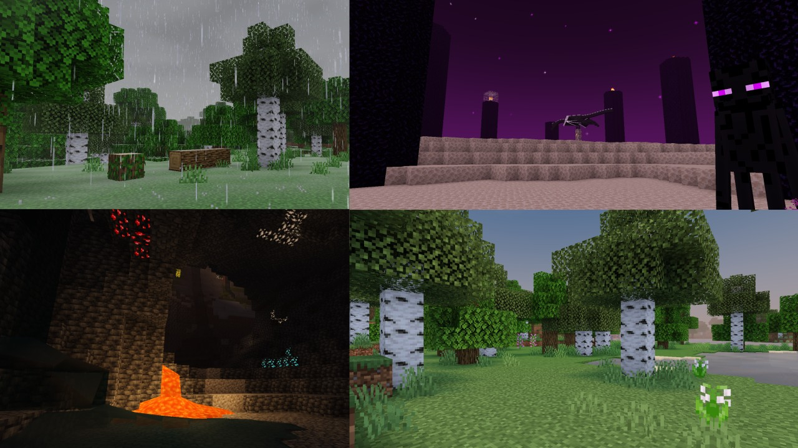

# Newb X Legacy

**Newb X Legacy** is a RenderDragon successor to the legacy GLSL shader, [Newb Shader](https://github.com/devendrn/newb-shader-mcbe). It is an enhanced vanilla shader that focuses on being lightweight and having soft aesthetics. It supports Minecraft Bedrock 1.21+ (Windows/Android/iOS).

<br>



## Downloads

You can download the shader pack from [release page](https://github.com/devendrn/newb-x-mcbe/releases/latest).

## Installation

> [!NOTE]
> Shaders are not officially supported on Minecraft Bedrock. The following are unofficial ways to load shaders. There are multiple ways to get it working. Start with the recommended method. If that doesn't work try the other method.

### Android

| **Using MB Loader APK (Recommended):** |
|:-|
| 1. Install [MB Loader APK](https://play.google.com/store/apps/details?id=io.bambosan.mbloader&pcampaignid=web_share) |
| 2. Launch Minecraft from MB Loader APK. |
| 2. Import the resource pack and activate it in global resources. |

| **Using Patched Minecraft:** |
|:-|
| 1. Install [Patched Minecraft App](https://devendrn.github.io/renderdragon-shaders/shaders/installation/android#using-patch-app) |
| 2. Import the resource pack and activate it in global resources. |

### Windows

| **Using BRD Mod (Recommended)** |
|:-|
| 1. Use [BetterRenderDragon](https://github.com/QYCottage/BetterRenderDragon/releases/latest) to enable MaterialBinLoader. |
| 2. Import the resource pack and activate it in global resources. |

| **Using Matject** |
|:-|
| 1. Follow this [guide](https://faizul726.github.io/matject/docs/guide-for-beginners) |

### Linux / Mac
This method is for [mcpelauncher-manifest](https://mcpelauncher.readthedocs.io/en/latest/getting_started/index.html).

| **Using mbl mod (Recommended): x86_64 arch** |
|:-|
| 1. Install [mcpelauncher-materialbinloader-mod](https://github.com/CrackedMatter/mcpelauncher-materialbinloader). |
| 2. Import the resource pack and activate it in global resources. |

| **Using shaders mod: x86_64, x86, arm64, arm arch** |
|:-|
| 1. Download [mcpelauncher-shadersmod](https://github.com/GameParrot/mcpelauncher-shadersmod/releases/latest). |
| 2. Follow this [guide](https://faizul726.github.io/guides/shadersmodinstallation) to setup. |

<br>

## Building

### Install dependencies
- [Git](https://git-scm.com/)
- [Python](https://www.python.org/) 3.11 or higher required
- Python packages:
  - [lazurite](https://veka0.github.io/lazurite/#installation) (Must be `v0.4.2`. Newer or older version may not be supported)
  - [rich](https://rich.readthedocs.io/en/stable/introduction.html#installation) (Must be `v13.x.x`)

### Get source code
```
git clone https://github.com/devendrn/newb-x-mcbe/
cd newb-x-mcbe
```

### Install dependencies from requirements.txt
*Skip if you already have installed those versions.*
```
python -m pip install -r requirements.txt
```

### Setup build environment
> [!NOTE]
> On Windows, run `.\build.bat` instead of `./build.sh` for all following commands.
```
./build.sh setup
```
This will download shaderc binary and material data required to build shader.

<br>

### Compile specific shader materials
```
./build.sh mats
```
Compiled material.bin files will be inside `build/<platform>/`

**Command usage:**
```
usage: build mats [-h] [-p {android,windows,merged,ios}] [-m M [M ...]] [-s S]

options:
  -h, --help            show this help message and exit
  -p {android,windows,merged,ios}
                        build profile
  -m M [M ...]          build materials (eg: Sky)
  -s S                  subpack config to use (eg: NO_WAVE)
```

### Compile and build full shader pack
```
./build.sh pack
```

The final mcpack will be inside `build/`.

**Command usage:**
```
usage: build pack [-h] [-p {android,windows,merged,ios}] [--no-zip] [--no-label] [-v V]

options:
  -h, --help            show this help message and exit
  -p {android,windows,merged,ios}
                        build profile
  --no-zip              don't make archive
  --no-label            don't label materials
  -v V                  version number eg: 17
```

> [!TIP]
> If you want to customize pack name, author, version and other details, you can do so in `src/newb/pack_config.toml`.

<br>

## Development

Clangd can be used to get code completion and error checks for source files inside include/newb. Fake bgfx header and clangd config are provided for the same.
- **Neovim**: Install clangd LSP.
- **VSCode**: Install [vscode-clangd](https://marketplace.visualstudio.com/items?itemName=llvm-vs-code-extensions.vscode-clangd) extension.

## License

**Source Code:** The "Newb Shader" source code is licensed under the MIT License. You are free to modify, distribute, and create derivative works based on the source code.

**Compiled Resource Packs (`.mcpack` files):** The compiled resource packs distributed by the "Newb Shader" project and its variant creators are copyrighted works with restrictions. See the `COPYRIGHT.txt` file within each resource pack for more information.
