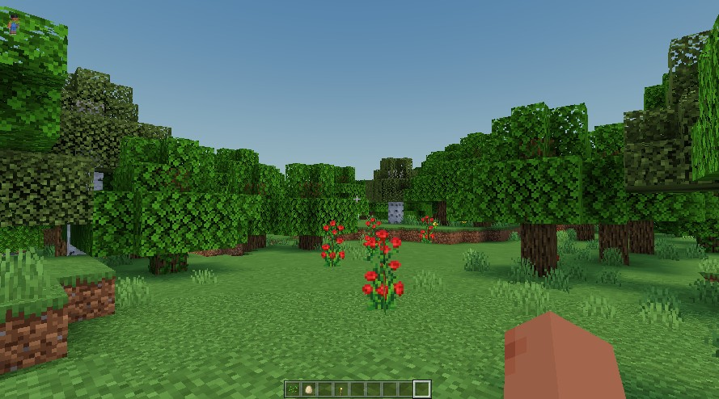

# newb-x-mcbe

Newb X is a legacy port (incomplete) of [newb-shader-mcbe](https://github.com/devendrn/newb-shader-mcbe) for MCBE Renderdragon platforms. It is based on the theme "lightweight and soft aesthetics".

> Note:
This is an experimental repository, breaking changes are made often.
Also, there is no guarantee of continued development.

## Screenshot



## Compiled files

Nightly builds for Android (ESSL) can be found at [Discord server](https://discord.gg/Cc4qsgHcYm).
For other platforms, you have to manually build from source.

## Installation

There are various ways to load custom material.bin files depending on your platform.
Please look elsewhere.

If you are using [minecraft-manifest](https://github.com/minecraft-linux/mcpelauncher-ui-manifest),
you can directly replace material.bin files inside data root (backup recommended).

## Building

This shader exists because of [MaterialBinTool](https://github.com/ddf8196/MaterialBinTool).

**Prerequisites:**

 - MaterialBinTool-0.8.x-all.jar
 - shaderc (modified)

MBT uses a modified bgfx shaderc to work with MCBE.
You can find this precompiled shaderc binary among MBT releases.
For linux x86_64, you can find one at [Discord server](https://discord.gg/Cc4qsgHcYm).

You should set up the directory structure as follows:

```
├── build/
├── data/
│   └── android/            <platform>
│       └── *.material.bin  <vanilla mb files>
├── env/
│   ├── bin/
│   │   └── shaderc
│   └── jar/
│       └── MaterialBinTool-0.8.x-all.jar
├── include/
├── material/
├── README.md
├── build.sh
└── setup.sh
```

#### Linux

Place the vanilla material.bin files (required ones only) inside `data/<platform>/`.
Now unpack the material.bin files by running:
```
./setup.sh
```
 To compile the material src files, run:
```
./build.sh
```
material.bin files will be now generated inside `build/<platform>/`

## Note

**Shaders are not officially supported on MCBE**.
Do not blame me if this shader doesn't work for you.
